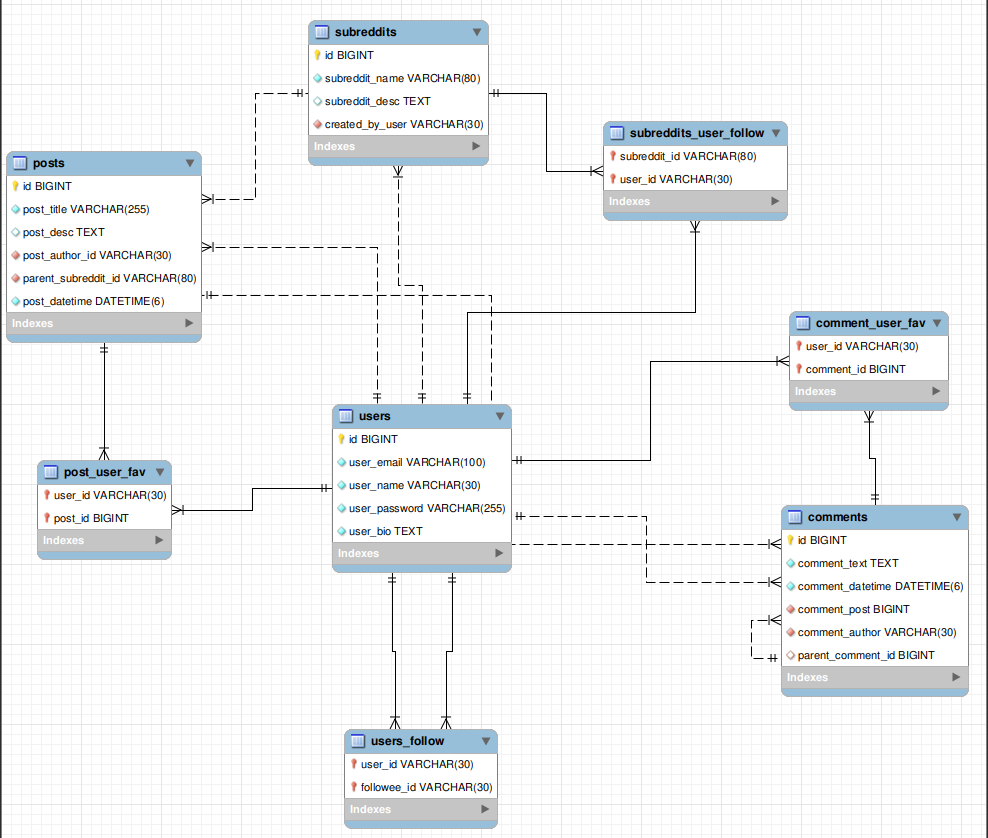

# RedditClone

A simple P0 Reddit clone implemented with Ktor Server side client, JWT Auth, Exposed ORM and My SQL

## Database Schema design



## Prerequisite

1. Kotlin
2. MySQL DB
3. Gradle

## Ktor Frameworks used

1. [Ktor Server side](https://ktor.io/docs)
2. [Coroutines](https://kotlinlang.org/docs/coroutines-overview.html)
3. [Koin](https://insert-koin.io/)
4. [Exposed ORM](https://github.com/JetBrains/Exposed)

## Features

- JWT Auth ✅
- Upvote/Downvote ✅
- Pagination ✅
- Nested Comments ✅
- Profile pictures/ images in posts 🚧

## How to setup the project

1. In [Application conf file](src/main/resources/application.conf) setup username and password for the Database.
2. Create database in the MySQL with the name **redditClone**.

## Why Exposed over other ORMs?

- Good control over creating [auto-incremented tables](https://github.com/JetBrains/Exposed/wiki/DSL#overview)
-
Simple [basic functions with well-supported conditional expressions](https://github.com/JetBrains/Exposed/wiki/DSL#basic-crud-operations)
- Intuitive way to interact between tables using [joins](https://github.com/JetBrains/Exposed/wiki/DSL#join)
- Easy to combine multiple requirements over a single (SQL query Sample from
  the [project](https://github.com/kamathis4/RedditClone/blob/main/src/main/kotlin/com/adikmt/repositories/PostRepository.kt))

## API reference

- [Auth Routes](src/main/kotlin/com/adikmt/routes/AuthRoutes.kt)
    - Login
    - Register
    - Get Current User
- [User Routes](src/main/kotlin/com/adikmt/routes/UserRoutes.kt)
    - Get Profile
    - Search User
    - Follow User
    - Un-Follow User
    - Get User Following Data
- [Subreddit Routes](src/main/kotlin/com/adikmt/routes/SubredditRoutes.kt)
    - Create Subreddit
    - Get Subreddit by Name
    - Search Subreddit
    - Follow Subreddit
    - Un-Follow Subreddit
    - Get Subreddits Followed by User
- [Post Routes](src/main/kotlin/com/adikmt/routes/PostRoutes.kt)
    - Create Post
    - Get Post by Id
    - Get PostFeed
    - Get Post by Subreddit Name
    - Get Post Created by User
    - Search Post by Heading
    - Upvote Post
    - Downvote Post
- [Comment Routes](src/main/kotlin/com/adikmt/routes/CommentRoutes.kt)
    - Create Comment
    - Get Comment by Id
    - Get Comment by Post
    - Get Comment by User
    - Upvote Comment
    - Downvote Comment

### 💬 Want to discuss?

Have any questions, doubts or want to present your opinions, views? You're always welcome.

### Find this project useful ?

Support it by clicking the ⭐️ button on the upper right of this page.

### License

```
MIT License

Copyright (c) 2023 Adithya Kamath

Permission is hereby granted, free of charge, to any person obtaining a copy of this software and associated 
documentation files (the "Software"), to deal in the Software without restriction, including without limitation 
the rights to use, copy, modify, merge, publish, distribute, sublicense, and/or sell copies of the Software, and 
to permit persons to whom the Software is furnished to do so, subject to the following conditions:

The above copyright notice and this permission notice shall be included in all copies or substantial 
portions of the Software.

THE SOFTWARE IS PROVIDED "AS IS", WITHOUT WARRANTY OF ANY KIND, EXPRESS OR IMPLIED, INCLUDING BUT NOT LIMITED TO 
THE WARRANTIES OF MERCHANTABILITY, FITNESS FOR A PARTICULAR PURPOSE AND NONINFRINGEMENT. IN NO EVENT SHALL THE 
AUTHORS OR COPYRIGHT HOLDERS BE LIABLE FOR ANY CLAIM, DAMAGES OR OTHER LIABILITY, WHETHER IN AN ACTION OF CONTRACT, 
TORT OR OTHERWISE, ARISING FROM, OUT OF OR IN CONNECTION WITH THE SOFTWARE OR THE USE OR OTHER DEALINGS IN THE SOFTWARE.
```