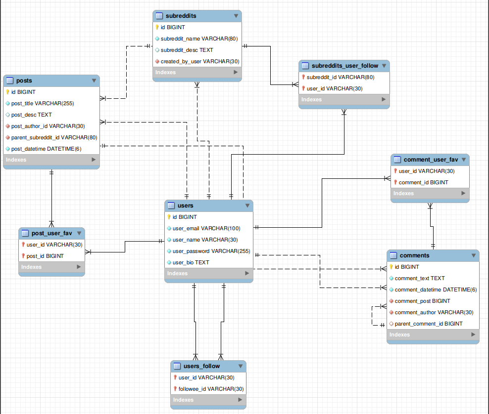

# RedditClone

## Database Schema design

## Prerequisite

1. Kotlin
2. MySQL DB
3. Gradle

## Ktor Frameworks used

1. [Ktor Server side](https://ktor.io/docs)
2. [Coroutines](https://kotlinlang.org/docs/coroutines-overview.html)
3. [Koin](https://insert-koin.io/)
4. [Exposed ORM](https://github.com/JetBrains/Exposed)

## Why Exposed over other ORMs?

- Good control over creating [auto-incremented tables](https://github.com/JetBrains/Exposed/wiki/DSL#overview)
- Simple [basic functions with well supported confditional expressions](https://github.com/JetBrains/Exposed/wiki/DSL#basic-crud-operations)
- Intutive way to interact between tables using [joins](https://github.com/JetBrains/Exposed/wiki/DSL#join)
- Easy to combine multiple requirements over a single SQL query (Sample from the [project] (https://github.com/kamathis4/RedditClone/blob/main/src/main/kotlin/com/adikmt/repositories/PostRepository.kt))
